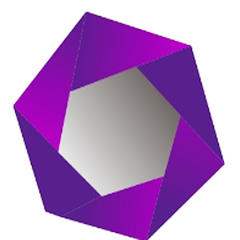

<br/>
<br/>
<p align="center" >
  
</p>
<br/>
<h2 align="center"><b>Project Gallery</b></h2>
<p align="center"> Checkout the list of projects worked on by myself 😌</p>
<br/>
<table align="center" border=0>
    <tr>
      <td align="center">
        <a href="https://play.google.com/store/apps/details?id=com.getdrench.com">
          
          <br>
          <p>Drench</p>
        </a>
      </td>
      <td align="center">
        <a href="https://play.google.com/store/apps/details?id=com.credility.crednow">
          
          <br>
          <p>Crednow</p>
        </a>
      </td>
      <td align="center">
        <a href="https://play.google.com/store/apps/details?id=com.halafoods.Hala">
          
          <br>
          <p>Halla Foods</p>
        </a>
      </td>
      <td align="center">
        <a href="https://apps.apple.com/us/app/daily-habit-tracker-to-do-list/id6477153983">
          
          <br>
          <p>Day Planner</p>
        </a>
      </td>
      <td align="center">
        <a href="https://play.google.com/store/apps/details?id=com.projectify.farminelligence&hl=en">
          
          <br>
          <p>Agri Axis</p>
        </a>
      </td>
    </tr>
    <tr>
      <td align="center">
        <a href="https://play.google.com/store/apps/details?id=com.credility.cashgo">
          
          <br>
          <p>Cashgo</p>
        </a>
      </td>
      <td align="center">
        <a href="https://play.google.com/store/apps/details?id=com.africhange.Africhange&hl=en">
          
          <br>
          <p>Africhange</p>
        </a>
      </td>
      <td align="center">
        <a href="https://play.google.com/store/apps/details?id=com.dailyhabittracking.dailyhabittrackertodolist">
          
          <br>
          <p>Task Manager</p>
        </a>
      </td>
      <td align="center">
        <a href="https://play.google.com/store/apps/details?id=com.sms.messges.textmessages">
          
          <br>
          <p>Messages</p>
        </a>
      </td>
      <td align="center">
        <a href="https://play.google.com/store/apps/details?id=com.niftystudio.purplestone">
          
          <br>
          <p>Purplestone</p>
        </a>
      </td>
    </tr>
    <tr>
      <td align="center">
        <a href="https://play.google.com/apps/internaltest/4701406071695718943/join?hl=en-US">
          
          <br>
          <p>Sefy</p>
        </a>
      </td>
      <td align="center">
        <a href="https://apkpure.com/gate-pass/com.acrespro.gatepass/download">
          
          <br>
          <p>Acrespro</p>
        </a>
      </td>
      <td align="center">
        <a href="https://www.amazon.com.br/Anthony-Aniobi-Solar-Consult/dp/B0C7NGM7FZ">
          
          <br>
          <p>Solar consult</p>
        </a>
      </td>
    </tr>
</table>

<h2 align="center"><b>Major Technologies</b></h2>
<table align="center">
    <tr>
      <td>
          <ul>
              <li align="center"><br/>Flutter<br/><br/></li>
          </ul>
      </td>
      <td>
        <ul>
          <li align="center"><br/>Swift<br/><br/></li>
        </ul>
      </td>
      <td>
        <ul>
          <li align="center"><br/>Python<br/><br/></li>
        </ul>
      </td>
      <td>
        <ul>
          <li align="center"><br/>Unity<br/><br/></li>
        </ul>
      </td>
    </tr>
</table>

<h2 align="center"><b>Notable Projects</b></h2>
<br/>
<table align='center'>
  <tr>
    <th>Mobile Apps</th>
    <th>Arduino Projects</th> 
    <th>AI Projects</th>
  </tr>
  <tr>
    <td><a href="https://github.com/AnthonyAniobi/Furniture_App_Swift_UI">Furniture App</a></td>
    <td><a href="https://github.com/AnthonyAniobi/AI_Robot_Assistant">Robot Assistant</a></td>
    <td><a href="https://github.com/AnthonyAniobi/Image_Classfication">Image Classification</a></td>
  </tr>
  <tr>
    <td><a href="https://github.com/AnthonyAniobi/EmployMobileApplication">Employ App</a></td>
    <td><a href="https://github.com/AnthonyAniobi/Automatic_Chicken_Brooder">Automatic Chicken Brooder</a></td>
    <td><a href="https://github.com/AnthonyAniobi/CPP_Neural_Networks">CPP Neural Networks</a></td>
  </tr>
  <tr>
    <td><a href="https://github.com/AnthonyAniobi/NewsApp">News App</a></td>
    <td><a href="https://github.com/AnthonyAniobi/Flutter-home-automation">Home Automation (IOT)</a></td>
    <td><a href=""></a></td>
  </tr>
</table>

<!-- <p align="center"><b>Software Engineering</b></p> -->

<hr/>
<br/>

### Languages and Tools:

<div align="center">


</div>
<hr/>
<br/>

<!-- <h2>Brief Overview</h2> -->

<!-- ```yaml
quick_overview:
  {
    name: "Anthony Aniobi Ogadimma",
    specialization:
      [
        "Software Engineer",
        "Embedded Systems Engineer",
        "Computer Aided Designer",
      ],
  }
``` -->

<!-- <hr> -->
<br/>
<br/>
<h2 align="center">Contact me</h2>
<!-- <p align="center">For all your software development needs, contact me at</p>
<p align="center">

</p> -->
<p align="center">
<a href="https://www.linkedin.com/in/anthony-aniobi/">
  
</a>
<a href="https://anthonyaniobi.medium.com/">
  
</a>
</p>
<hr>
<br/>

<br/>
<br/>
<h2 align="center"> 📈 &nbsp;My GitHub History!</h2>

<br/>
<br/>

<!--  -->

<!-- [](https://visitcount.itsvg.in) -->

<!-- [](https://github.com/AnthonyAniobi) -->

<p align="center">
  
</p>
